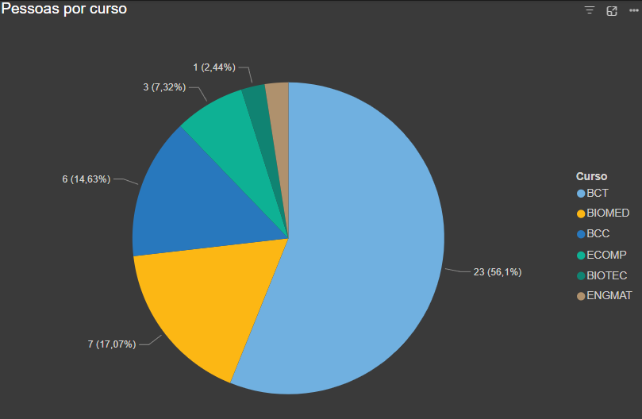
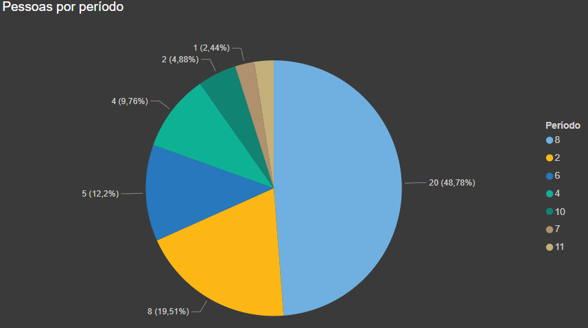
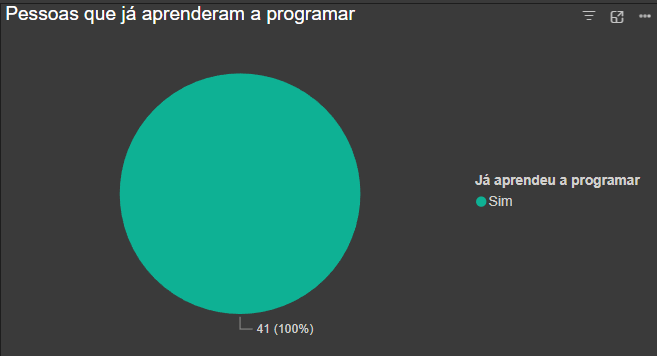
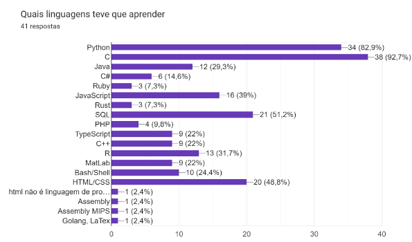
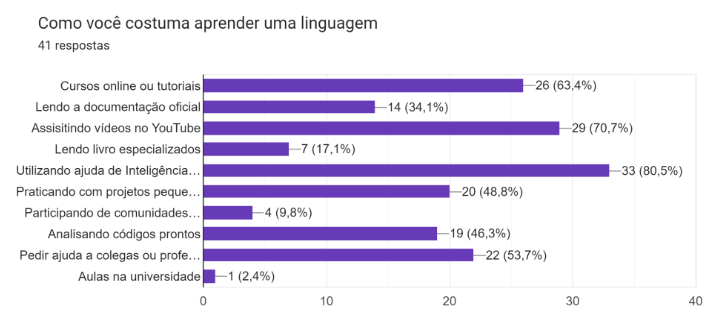
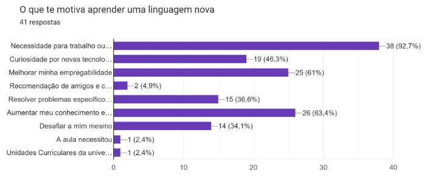
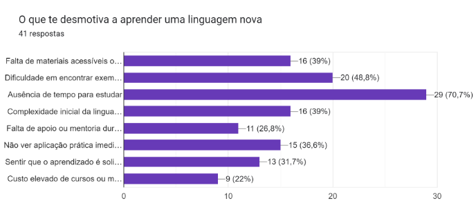

# IHC_Project

Um sistema web acessível que utiliza IA para ensinar linguagens de programação. Ele oferece tradução automática de código entre linguagens e tutoriais interativos, visando capacitar estudantes universitários, de baixa renda e pessoas iniciantes em tecnologia. O sistema será usado em contextos educacionais, principalmente por indivíduos em busca de aprendizado técnico.

---

## Descrição sucinta do projeto

Um sistema web acessível que utiliza IA para ensinar linguagens de programação. Ele oferece:
- Tradução automática de código entre linguagens.
- Tutoriais interativos.
- Suporte para aprendizado em dispositivos móveis e offline.

O objetivo é capacitar estudantes de baixa renda e pessoas iniciantes em tecnologia, promovendo inclusão e acessibilidade no aprendizado técnico.

---

## Stakeholders e descrição

### **Stakeholders Identificados**

1. **Estudantes universitários**
   - Principais usuários do sistema.
   - Buscando aprender novas linguagens
   - Complementar sua formação acadêmica.
     
2. **Estudantes de Baixa Renda**  
   - Pouca experiência técnica.  
   - Alta motivação para aprender.  
   - Acessam via celulares e computadores básicos.
       
3. **Educadores/Instituições de Ensino**  
   - Experiência intermediária em tecnologia.  
   - Interesse em integrar o sistema em suas aulas.

4. **Empresas de Tecnologia**  
   - Potenciais parceiros para infraestrutura ou patrocínio.

---

## Métodos de Pesquisa

### **Método 1: Pesquisa por Formulário Online (Google Forms)**

#### **Justificativa**
- Permite coletar dados de um público amplo de forma rápida e eficiente, ideal para validar hipóteses iniciais e entender as necessidades gerais dos usuários.

#### **Perfil dos Respondentes**
- A maioria dos participantes são estudantes dos cursos:
  - **BCT** (Bacharelado em Ciência e Tecnologia)
  - **BCC** (Bacharelado em Ciência da Computação)
  - **BIOMED** (Biomedicina)
  - **ECOMP** (Engenharia da Computação)

 

 
- Os respondentes variam do **2º ao 11º período**, abrangendo estudantes com diferentes níveis de experiência acadêmica.
- A maioria dos participantes estão no 8 período

#### **Resultados**

##### **Experiência Prévia**
- Todos respondentes já aprenderam alguma linguagem de programação.

##### **Linguagens Mais Populares**
1. **C (92,7%)**
2. **Python (82,9%)**
3. **SQL (51,2%)**
4. **HTML/CSS (48,8%)**

##### **Métodos de Aprendizagem Preferidos**
1. **Utilizar ajuda de Inteligência Artificial (80,5%)**
2. **Assistindo vídeos no Youtube (70,7%)**
3. **Cursos online ou tutoriais (63,4%)**

##### **Motivações para Aprender Programação**
1. **Necessidade para trabalho ou projeto (92,7%)**
2. **Aumentar meu conhecimento e habilidades gerais (63,4%)**
3. **Melhorar minha empregabilidade (61%)**

##### **Principais Desafios**
1. **Ausência de tempo para estudar (70,7%)**
2. **Dificuldade em encontrar exemplos práticos (48,8%)**
3. **Falta de materiais acessíveis ou de qualidade (39%)**
4. **Complexidade inicial da linguagem (39%)**

---

### **Método 2: Entrevistas com Usuários**

#### **Justificativa**
- Complementa os dados quantitativos do Google Forms com insights mais profundos sobre a experiência e as necessidades do usuário.

#### **Descobertas**
**1. Preferências de Aprendizado:**

- Material escrito com exemplos práticos e exercícios para fixação
- Conteúdo visual e interativo, com menos foco em teoria extensa
- Uso de inteligência artificial (como ChatGPT) para entender conceitos e comparar linguagens

**2. Recursos Valorizados:**

- Documentação técnica clara e acessível
- Exemplos de código com explicações detalhadas
- Comparações entre diferentes linguagens de programação

**3. Abordagem de Aprendizado:**

- Começar com conceitos básicos e progredir para aplicações práticas
- Aprender por meio de projetos e resolução de problemas reais
- Utilizar fóruns e comunidades online para tirar dúvidas

**4. Desafios Identificados:**

- Dificuldade em encontrar recursos que equilibrem teoria e prática
- Necessidade de adaptação rápida a novas linguagens ou frameworks

**5. Sugestões para a Plataforma:**

- Integração de IA para assistência personalizada
- Ferramentas para comparação de código entre diferentes linguagens
- Sistema de progressão que guie o usuário do básico ao avançado
---

## Reflexão sobre os métodos

- **O que deu certo**:  
  - O Google Forms capturou respostas de um número maior de pessoas, identificando tendências gerais.
  - As entrevistas trouxeram insights detalhados, como a preferência por métodos de estudo entre o público alvo.

- **O que deu errado**:  
  - A grande maioria das respostas do forms foram feitas por pessoas nos semestres mais avançados.
  - Durante as entrevistas, tivemos dificuldade em conseguir marcar horário com diferentes partes do público-alvo.

- **O que fazer diferente**:  
  - Buscar algum incentivo para atingir um grupo maior de respondentes.
  - Conseguir marcar entrevistas com mais pessoas, ou seja atingindo todas partes do público-alvo.

---

## Descrições de tarefas

1. Estudante inicia uma sessão para aprender Python básico com exercícios interativos.  
2. Usuário traduz código Java para Python e realiza adaptações com dicas da IA.  
3. Educador cria uma turma e compartilha material personalizado pela plataforma.  
4. Usuário recebe feedback em tempo real para corrigir erros de sintaxe.  
5. Estudante utiliza um curso sobre biblioteca específica que precisa ser utlizada.  
6. Desenvolvedor em transição testa novos recursos aprendidos em projetos simples na plataforma.  
7. Sistema sugere cursos adicionais com base no progresso do estudante.  
8. Usuário termina de estudar um módulo e recebe uma sugestão de projeto da plataforma.

---

## Links para materiais utilizados

- **Google Forms**: Formulário com perguntas sobre aprendizado de programação.  
- **Notas de Entrevistas**: Resumos das conversas realizadas com usuários potenciais.  
- **Capturas de Tela**: Exemplos de respostas coletadas via formulário e entrevista.

---
